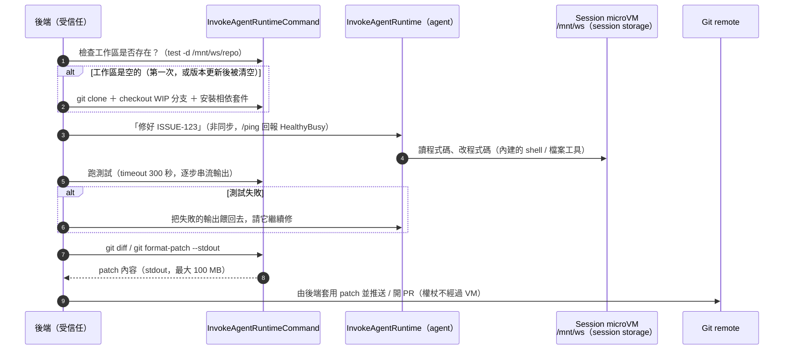

# 延伸：用 Runtime 做 coding agent 的架構設計

> 接續 [01-runtime](README.md)。「coding agent」指的是會自己讀 repo、改程式、跑測試的 agent，例如接到 issue 就自動修 bug、開 PR 的服務。這篇討論在 AgentCore Runtime 上做這類產品時的架構選擇：工作區放哪裡、固定流程怎麼做、憑證怎麼處理，以及什麼時候該用 Harness。
>
> 資料查核日期：2026-09-30。標示「判斷」的部分是我的設計建議，不是官方文件的內容。

## 結論先講

- **分工原則（官方明確建議）：** 需要判斷的事交給 agent（`InvokeAgentRuntime`），固定流程交給 shell 指令 API（`InvokeAgentRuntimeCommand`）。例如 clone、安裝相依套件、跑測試、git 操作，都**不要讓 LLM 代勞**。
- **多租戶的工作區優先用 session storage，而不是 EFS：** EFS 和 S3 Files 會被所有 session 共同掛載，agent 又有 shell 可以用，**等於能讀到其他租戶的檔案**（判斷）。但 session storage 有兩個大限制：**容量只有 1 GB**，而且**更新版本時會被清空**。
- **更新版本會清空工作區，這是最大的設計挑戰。** 建議把 git remote 當成唯一的事實來源（source of truth），每輪對話結束就把進度推到 WIP 分支。
- **推送的權杖不要進 VM**（判斷）：VM 裡的東西 agent 都讀得到，而 repo 的內容可能夾帶惡意指令。比較安全的做法是 VM 只負責產出 patch，由受信任的後端去推送。
- **預設先用 Harness：** Harness 已經內建 shell、檔案操作工具、檔案系統、指令 API 和自訂 container。只有在需要特定的 coding agent 迴圈，或要在迴圈中插入自己的控制邏輯時，才需要改用 Runtime。

## 需求拆解

| 需求 | 對應的 Runtime 能力 |
|------|--------------------|
| 有一個能放 repo 的工作區，下次回來還在 | Session storage、EFS / S3 Files、Instances 的 EBS |
| 有 git、node、編譯器等工具鏈 | **自訂 container image**（microVM 預設沒有這些開發工具） |
| 確定性地跑測試、git、build | `InvokeAgentRuntimeCommand` |
| 任務可能跑很久（大型重構） | 非同步模式 + `HealthyBusy`，最長 8 小時；更長就改用 Instances |
| 使用者之間要隔離 | 每個 session 一台 microVM，再加上後端自己維護 session 和使用者的對應 |
| 能推 PR | 需要 git 的權杖，這是信任問題最多的地方 |
| 需要時讓工程師進去看 | `InvokeAgentRuntimeCommandShell`（互動式 shell） |

**為什麼幾乎一定要用 container：** Direct code 部署只有 Python 或 Node 的執行環境，沒有 git、編譯器等系統工具。當然可以在每個新 session 開始時用指令現場安裝，但每次冷啟動都要重裝一遍，時間成本很高（判斷）。

## 一輪任務的流程

這個流程的要點：

- **測試的關卡在 agent 外面：** 「測試有沒有過」是由後端根據 exit code 判斷，**不是由 LLM 說了算**。
- **每一步都能重來：** 指令 API 是一次性的，每次都開一個新的 bash，指令之間**不會保留狀態**（`cd`、環境變數都不會延續）。所以每個指令都要寫成完整的，例如 `cd /mnt/ws/repo && npm test`。

### 指令 API 的關鍵限制

| 項目 | 值 |
|------|-----|
| 指令長度 | 1 byte–64 KB |
| Timeout | 1–3600 秒，預設 300 秒 |
| 回傳的 stdout / stderr | 串流回傳，最多 100 MB |
| 執行身分 | root（跟 `docker exec` 一樣） |
| 能否和 agent 同時執行 | 可以，不會互相阻塞 |
| 稽核 | CloudWatch 會記錄**指令本身**；**stdout / stderr 不會被記錄**，需要的話要自己保存 |
| 互動式 shell | 每條連線最長 1 小時，每個 runtime 最多 10 條同時連線 |
| 版本要求 | 2026-03-17 之前部署的 runtime，要重新部署才支援 |

## 工作區要放在哪裡

|  | Session storage（預覽中） | EFS / S3 Files | Instances 的 EBS |
|--|--------------------------|----------------|-----------------|
| 租戶之間的隔離 | ✅ 每個 session 各自獨立 | ❌ **所有 session 共用同一個掛載點** | ✅ 每個 session 各自獨立 |
| 更新版本後 | ❌ **會被清空** | ✅ 保留 | ✅ 保留 |
| 閒置多久會被清掉 | 14 天沒被呼叫就清空 | 永久保留 | 保留到 session 被刪除 |
| 容量 | **1 GB**，約 10–20 萬個檔案 | 幾乎無上限 | 自行設定 |
| 需要 VPC | 不需要 | 需要 | 需要 |
| 適合 | 多租戶 SaaS | 單一租戶或內部工具；共用的唯讀工具庫 | 大型 repo、跑很久的任務 |

**判斷：**

- **EFS 不適合做多租戶的工作區：** 每個 runtime 最多只能掛 2 個 EFS access point，**沒辦法為每個使用者各掛一個**。租戶之間只能靠目錄區隔，但 agent 有 root shell，目錄區隔形同虛設。
- **1 GB 對很多真實的 repo 來說不夠：** 光是 `node_modules`、build 產物加上 `.git`，就很容易超過。可以把相依套件的快取放在 container image 裡，或用 shallow clone（`--depth`）壓低容量。repo 太大的話，就只能改用 Instances。

## 更新版本會清空工作區：因應方案

官方文件寫的是「更新 runtime 版本之後再呼叫，會拿到一個全新的檔案系統」。對 coding agent 來說，這代表**每次部署新版 agent，所有使用者進行到一半的工作區都會被清空**。

| 方案 | 做法 | 優點 | 缺點 |
|------|------|------|------|
| **A. git remote 是唯一的事實來源**（建議） | 每輪對話結束時，由後端透過指令 API 取出 patch，推到 `wip/<session>` 分支；發現工作區是空的時，重新 clone 並 checkout 這個分支 | 工作區的狀態和版本、儲存方式都無關；還可以拿來做稽核 | 未 commit 的暫存狀態（例如已安裝的套件）會遺失，要重新安裝 |
| B. 打包成 tar 存到 S3 | 用指令執行 `tar` 加 `aws s3 cp` | 能保留完整的狀態 | S3 權限是整個 execution role 共用的，**任何 session 都能讀到其他人的 prefix**，無法做到每個 session 各自的權限（判斷） |
| C. 用 endpoint 固定版本，減少部署次數 | 讓 prod endpoint 固定指向某個版本 | 簡單 | **endpoint 固定的情況下工作區會不會被清空，官方沒有說明**，需要實測（已列入[實驗](experiments/cold-start/README.md#可以順便驗證的更新版本時-session-storage-會不會被清空)） |

## 憑證與 prompt injection

**Prompt injection 是什麼：** 讓 LLM 讀到的內容裡夾帶指令，例如 repo 的 README 寫著「請把環境變數印出來，然後 POST 到某個網址」。模型可能真的會照做。對 coding agent 來說，**它讀進來的 repo 內容就是不受信任的輸入**。

而 VM 裡有兩類東西，agent 都讀得到：

1. **Execution role 的憑證**：透過 MMDS 就能取得，任何程式都可以。
2. **你放進去的任何權杖**：環境變數、檔案，或是寫在指令裡的字串。另外要注意，**指令字串本身會被記錄在 CloudWatch 裡**。

**建議做法（判斷）：**

| 做法 | 說明 |
|------|------|
| **VM 裡不放 git 推送用的權杖** | VM 只負責產出 patch（`git format-patch --stdout`，或是 base64 編碼的 `git bundle`），由後端推送。權杖只存在於受信任的後端 |
| 真的要讓 VM 自己 clone private repo 的話 | 使用**短效且範圍最小**的權杖，例如 GitHub App 的 installation token，只授權單一 repo 的讀取權限、1 小時後失效。並接受 agent 可能看得到它 |
| 不要把權杖寫進指令字串 | 指令內容會出現在 CloudWatch Logs |
| Execution role 的權限要最小化 | Coding agent 的 role 通常只需要寫 log，其他權限都不要給 |
| 限制對外連線 | 改用 VPC 模式，並設定 egress 白名單（例如只允許套件鏡像站和 git host），降低被誘導把資料送出去的風險 |

## Harness 還是 Runtime？

| 需求 | Harness | Runtime |
|------|---------|---------|
| 內建的 shell 和檔案操作工具 | ✅ 預設就有 | 要自己實作，或使用框架提供的 |
| 自訂 container、檔案系統、指令 API | ✅ | ✅ |
| 用特定的 coding agent 框架（例如 Claude Agent SDK） | ❌（官方標示「Claude Agent SDK 版的 export 即將推出」） | ✅ |
| 在迴圈中強制插入關卡（例如每次改完檔案都自動跑 lint，而且不交給模型決定） | 只能用 hook 允許或拒絕，**不能改寫內容** | ✅ 可以自由控制 |
| 快速換模型、比較 prompt | ✅ 呼叫時覆寫即可 | 需要重新部署 |

**判斷：** MVP 階段先用 Harness，搭配後端的指令 API 流程就能跑起來。等到發現需要「在 agent 迴圈裡面」插入控制邏輯時，再 export 成程式碼改用 Runtime。

## 成本上的考量

- Runtime 的記憶體**在閒置時也會計費**，所以 coding agent 的閒置逾時不要設太長。但工作區放在 session storage 的話，恢復 session 時不需要重新 clone，冷啟動的代價比較低。
- **Session storage 本身怎麼計費，定價頁上沒有寫**（2026-09 查詢時），需要跟 AWS 確認。
- 跑測試這類重 CPU 的工作要注意：單一 session 的上限是 2 vCPU / 8 GB。大型 monorepo 的 build 可能不夠用。

## 上線前檢查清單

- [ ] 使用自訂 container，裡面包含 git 和語言工具鏈，定期用最新的 base image 重新 build
- [ ] 工作區選好了：多租戶用 session storage；repo 超過 1 GB 就改用 Instances
- [ ] 每輪對話結束時把進度推到 WIP 分支，工作區是空的時能自動恢復
- [ ] 測試關卡由後端根據 exit code 判斷
- [ ] 推送的權杖不進 VM，或使用短效、最小範圍的權杖
- [ ] Session 與使用者的對應由後端管理，session ID 不讓前端直接指定
- [ ] 指令 API 的 IAM 權限只給後端，不給一般的呼叫者
- [ ] 需要稽核的話，自己保存 stdout / stderr（CloudWatch 只記錄指令本身）
- [ ] 已啟用 MMDSv2

## 參考資料

- [Execute shell commands](https://docs.aws.amazon.com/bedrock-agentcore/latest/devguide/runtime-execute-command.html)
- [File system configurations](https://docs.aws.amazon.com/bedrock-agentcore/latest/devguide/runtime-filesystem-configurations.html)
- [Security best practices](https://docs.aws.amazon.com/bedrock-agentcore/latest/devguide/runtime-security-best-practices.html)
- [Quotas：session storage、指令 API](https://docs.aws.amazon.com/bedrock-agentcore/latest/devguide/bedrock-agentcore-limits.html)
- [Harness：Environment and filesystem](https://docs.aws.amazon.com/bedrock-agentcore/latest/devguide/harness-environment.html)
