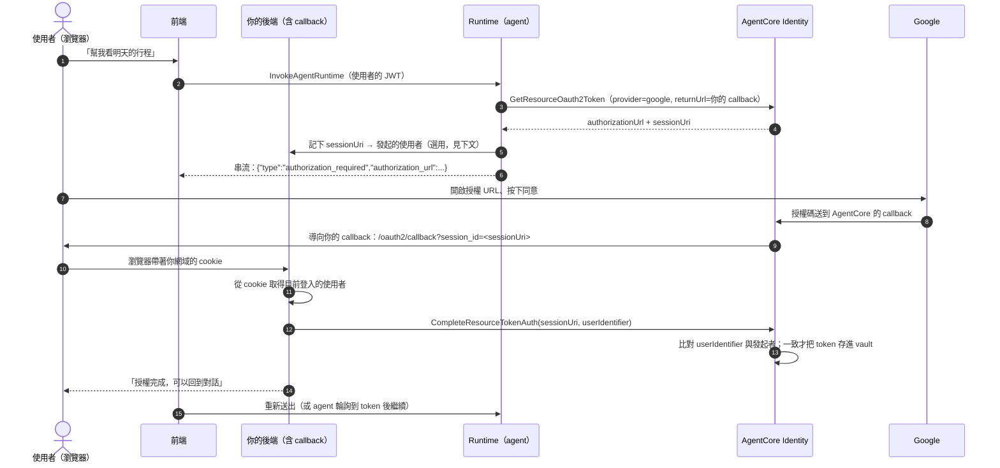

# 延伸：3LO 的前後端參考實作

> 接續 [04-identity](README.md#2-3lo-的-session-binding-與-csrf)。這篇把 3LO（使用者授權 agent 存取他在第三方的資料）的每一段接起來：授權 URL 怎麼送到前端、callback 端點怎麼做 session binding、CSRF 怎麼防，以及各家 SaaS 的 refresh token 設定和授權被撤銷之後怎麼處理。
>
> 資料查核日期：2026-09-30。標示「推論」的部分是官方文件沒有明說、由我推導的。
>
> 本機實作：[experiments/3lo-callback](experiments/3lo-callback/)（callback 端點的參考實作與 6 個測試案例，**已在本機實跑通過**；AgentCore 的 API 以假的 client 代替，沒有接真的服務）。

## 結論先講

- **3LO 有兩個 callback，不要搞混：**
  1. **AgentCore 的 callback**（每個 credential provider 一個，註冊在 Google、Slack 等第三方的後台）：第三方把授權碼送到這裡，由 AgentCore 換 token。
  2. **你的 callback**（註冊在 workload identity 的 `allowedResourceOauth2ReturnUrls`）：AgentCore 把瀏覽器導回這裡，由你確認「按下同意的人」是誰，再呼叫 `CompleteResourceTokenAuth`。**這一個一定要自己實作**。
- **Session binding 的核心只有一句話：** callback 裡的使用者身分，**只能從瀏覽器自己的登入 session（cookie）取得**。AgentCore 會比對它跟「發起授權的使用者」是否一致。
- **授權 URL 送到前端的方式要配合 agent 的執行模型：** SDK 預設會**卡住工具呼叫、每 5 秒輪詢，最多 10 分鐘**。對話型的應用通常更適合「中斷這一輪、把 URL 推給前端、使用者授權完再重來」。
- **Token 撤銷 AgentCore 偵測不到。** 呼叫第三方 API 收到 401 時，要帶 `forceAuthentication=true` 重新走一次授權。

## 完整流程



## 設定

### 1. Credential provider：註冊第三方的 callback

`CreateOauth2CredentialProvider` 會回傳一個**每個 provider 各自不同的 `callbackUrl`**，要把它註冊到第三方的 OAuth app 設定裡。官方說這能「防止跨 provider 的重放和 CSRF 類攻擊」。

⚠️ **文件裡的 callback URL 格式不一致：** session binding 頁寫 `https://bedrock-agentcore.amazonaws.com/identities/callback/<id>`，各 provider 的設定頁寫 `https://bedrock-agentcore.<region>.amazonaws.com/identities/oauth2/callback/<uuid>`。**以 API 實際回傳的為準。**

### 2. Workload identity：註冊你的 callback

```bash
aws bedrock-agentcore-control update-workload-identity \
  --name <runtime ID 或 gateway ID> \
  --allowed-resource-oauth2-return-urls https://myagentapp.com/oauth2/callback
```

- 用 Runtime 或 Gateway 時，workload identity 的名稱就是 runtime ID 或 gateway ID。
- `GetResourceOauth2Token` 的 `resourceOauth2ReturnUrl` **必須是這裡註冊過的其中一個**。

## 授權 URL 怎麼送到前端

### `GetResourceOauth2Token` 的相關欄位

| 欄位 | 作用 |
|---|---|
| `resourceOauth2ReturnUrl` | 授權完成後把瀏覽器導回哪裡 |
| `sessionUri` | 第一次不帶；拿到 URL 後，**輪詢時帶上同一個** |
| `forceAuthentication` | `true` 時一定重新走授權流程，並**清掉 refresh token** |
| `customState` | 不透明字串，會帶回你的 callback，官方說明是用來防 CSRF（最多 4,096 字元） |
| `customParameters` | 額外送給第三方的參數，例如 Google 的 `access_type=offline` |

回應有兩種：直接拿到 `accessToken`，或拿到 `authorizationUrl` + `sessionUri`（狀態 `IN_PROGRESS`）。

### SDK 的預設行為

`@requires_access_token` decorator 的流程（依 SDK 原始碼）：

1. 呼叫 `GetResourceOauth2Token`，有 token 就直接用。
2. 拿到授權 URL 時，呼叫你提供的 `on_auth_url(url)`。
3. 之後**每 5 秒用同一個 `sessionUri` 輪詢，最多 600 秒**（可以換成自訂的 `TokenPoller`）。輪詢時會把 `forceAuthentication` 改回 `false`，只有第一次才強制重新授權。

**也就是說，工具呼叫會卡住最多 10 分鐘。**

### 三種送法

| 方式 | 做法 | 適合 | 注意 |
|---|---|---|---|
| **串流** | `on_auth_url` 把 `{"type": "authorization_required", "authorization_url": url}` 寫進 SSE 或 WebSocket | **對話型應用**（最常見） | 前端要能辨識這個事件並顯示按鈕 |
| **Callback / webhook** | `on_auth_url` 呼叫你的後端，由後端通知使用者（推播、Email、Slack 訊息） | 非同步、長時間執行的 agent | 使用者可能很久之後才看到，10 分鐘就過期 |
| **輪詢** | `on_auth_url` 把 URL 存起來（官方範例 TTL 300 秒），前端定期查詢 | 前端不支援串流 | 多一個查詢端點 |

### 「卡住等待」還是「中斷重來」（判斷）

| | 卡住等待（SDK 預設） | 中斷重來 |
|---|---|---|
| 做法 | 工具呼叫一直輪詢，直到拿到 token | `on_auth_url` 丟出例外（例如 `AuthorizationRequiredError`），串流層接住後把 URL 送給前端，這一輪結束 |
| 優點 | 使用者授權完，agent 自動繼續 | 不佔用 Runtime 的執行時間；逾時行為清楚 |
| 缺點 | Runtime session 一直在計費；使用者沒授權的話，要等滿 10 分鐘才失敗 | 使用者授權後要重新送出訊息（或前端自動重送） |
| 適合 | 使用者就在畫面前、很快就會按同意 | **大多數對話型應用** |

AWS 在 2026-05 的 ECS 部落格範例，用的就是「中斷重來」。

**經過 Gateway 的 MCP 工具**不需要自己處理：Gateway 會回傳 MCP 的 URL 型 elicitation 錯誤（JSON-RPC error code `-32042`），裡面帶著授權 URL，由 MCP client 顯示給使用者。

## 你的 callback 端點

### 官方的要求

- 從 query string 取得 `session_id`（就是 `sessionUri`）。
- **使用者身分要從瀏覽器目前的登入 session 取得**（cookie 或 local storage），官方原文：「should NOT be pulled from any remote session cache」。
- 呼叫 `CompleteResourceTokenAuth(sessionUri, userIdentifier)`，`userIdentifier` 是 `{"userId": ...}` 或 `{"userToken": <JWT>}`，**必須跟發起授權時產生 workload access token 用的是同一個身分**。
- 使用者不一致時：「your application simply does nothing or logs the attempt」。

**比對發起者的工作其實是 AgentCore 在做的**：它會檢查 `userIdentifier` 是否等於當初的發起者。你的責任是**確保傳進去的身分是真的**，也就是只從瀏覽器的登入 session 取得。如果你從 query string、或從「某個 session ID 對應的快取」取得使用者，攻擊者就能讓 AgentCore 以為是同一個人。

### 參考實作

本篇附的 `app.py` 做了三個檢查（第 1 點是官方要求之外的補強）：

1. **這個授權連結是發給誰的：** agent 拿到授權 URL 時，記下 `sessionUri → 發起的使用者`，**用一次就刪除**，並在 10 分鐘後過期。
2. **回來的是誰：** 只從瀏覽器的 cookie 對應到你自己的登入 session。
3. **兩者一致才呼叫 `CompleteResourceTokenAuth`。**

AgentCore 已經會做第 3 點的比對，自己再做一次的好處（判斷）：

- **錯誤訊息清楚：** 可以直接告訴使用者「這個連結不是發給你的」，而不是讓 AgentCore 靜默失敗。
- **稽核：** 每次被拒絕都有紀錄，可以偵測有人在轉傳授權連結。
- **一次性：** 同一個 `session_id` 不能被重放。

本機測試結果：

```
✓ 沒登入就打 callback                 status=400
✓ mallory 拿到 alice 的授權連結        status=403
✓ alice 正常完成                      status=200  complete 累計呼叫=1
✓ 同一個 session_id 重放              status=400
✓ 被轉傳過的連結，alice 自己再用也失效  status=400
✓ 超過 10 分鐘                        status=400
```

- **「被轉傳過的連結，alice 自己再用也失效」是刻意的設計：** 連結被別人用過一次（即使被拒絕）就作廢，alice 要回到對話重新開始。這比讓連結繼續有效安全，代價是使用者要多操作一次（判斷）。
- **正式環境的儲存要換成有 TTL 的共享儲存**（DynamoDB、Redis），因為 agent 和 callback 很可能不在同一個程序裡。

### CSRF 與 `customState`

- `customState` 會被帶回你的 callback，官方建議拿來防 CSRF：發起時產生一個隨機值、存在使用者的 session 裡，callback 時比對。
- ⚠️ **帶回 callback 時用的是哪個 query 參數名稱，文件沒寫**，要實測。
- **在確認之前，上面「sessionUri 對應發起者 + 一次性使用」的做法已經能達到類似的效果**：攻擊者無法讓受害者的瀏覽器完成一個不是發給受害者的授權（推論）。

### 官方範例的缺陷

官方 3LO 範例的 callback server（`oauth2_callback_server.py`）只在記憶體裡保存**一個**使用者身分，由應用程式推送進去，**沒有檢查瀏覽器的 cookie**。這只適合單人開發測試，**不符合上面的官方要求**，不能直接用在正式環境。

## Refresh token 與撤銷

### 各家的 refresh token 設定

| 供應商 | 設定方式 |
|---|---|
| Google | `"customParameters": {"access_type": "offline"}` |
| Microsoft | scope 加上 `offline_access` |
| Salesforce | scope 加上 `refresh_token`；app 要開啟 PKCE 與「Require Secret for the Web Server Flow」 |
| Atlassian | scope 加上 `offline_access` |
| GitHub | App 設定開啟「User-to-server token expiration」 |
| Slack | App 設定開啟「token rotation」 |
| LinkedIn | App 設定開啟 refresh token |

**沒有設定的話，access token 一過期（通常 1–2 小時）使用者就要重新授權。** 這是導入後最常見的抱怨（推論）。

### Token 的生命週期

| 情況 | AgentCore 的行為 | 你要做的 |
|---|---|---|
| Access token 過期，refresh token 還有效 | 自動換新，使用者無感 | 無 |
| Refresh token 也過期（通常約 30 天） | 回傳新的授權 URL | 跟第一次授權一樣處理 |
| 使用者在第三方撤銷授權 | **偵測不到**，照樣回傳舊 token | 呼叫第三方收到 **401** 時，用 `forceAuthentication=true` 重來 |
| 使用者想在你的應用裡「中斷連結」 | Consent portal 有「Disconnect」功能 | ⚠️ 它會不會呼叫第三方的撤銷端點，文件沒寫 |

**401 的處理要放在工具層（判斷）：** 包一層「呼叫第三方 → 401 → 帶 `forceAuthentication=true` 再拿一次 token → 送出授權 URL」的邏輯，不要讓模型自己看著 401 重試。

## 常見的坑

1. **把兩個 callback 搞混：** 第三方後台要註冊的是 AgentCore 的 callback，不是你自己的。
2. **本機開發時 `agentcore dev` 代管了 callback**，部署後才發現沒有實作。
3. **用 query string 或快取取得使用者身分**，讓 session binding 失效。
4. **沒開 refresh token**，使用者每幾個小時就要重新授權。
5. **Gateway 的 DYNAMIC 模式 MCP target 不能搭配 3LO。**
6. **Consent portal 的 target 的 `defaultReturnUrl` 必須是 `<portalUrl>/connect/callback`**，連線清單會快取 5 分鐘。

## 參考資料

- [OAuth2 authorization URL session binding](https://docs.aws.amazon.com/bedrock-agentcore/latest/devguide/oauth2-authorization-url-session-binding.html)
- [Identity authentication](https://docs.aws.amazon.com/bedrock-agentcore/latest/devguide/identity-authentication.html)
- 各 provider 設定：[Google](https://docs.aws.amazon.com/bedrock-agentcore/latest/devguide/identity-idp-google.html)、[Microsoft](https://docs.aws.amazon.com/bedrock-agentcore/latest/devguide/identity-idp-microsoft.html)
- [Gateway 3LO](https://docs.aws.amazon.com/bedrock-agentcore/latest/devguide/gateway-using-auth-ex-3lo.html)、[Consent portal target](https://docs.aws.amazon.com/bedrock-agentcore/latest/devguide/identity-configure-consent-portal-target.html)
- [aws/bedrock-agentcore-sdk-python](https://github.com/aws/bedrock-agentcore-sdk-python)（`requires_access_token`、`services/identity.py`）
- [awslabs/amazon-bedrock-agentcore-samples](https://github.com/awslabs/amazon-bedrock-agentcore-samples)：`01-features/05-authenticate-and-authorize/02-outbound-auth/02-outbound-auth-3lo`
