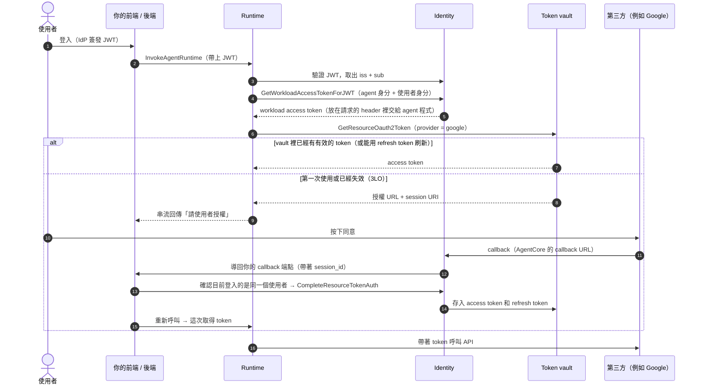

# Identity

> Agent 的身分與存取管理：驗證「誰在呼叫 agent」（inbound），並安全地保管「agent 代表誰、用什麼憑證去呼叫外部服務」（outbound）。
>
> 資料查核日期：2026-09-30。Runtime 和 Gateway 各自的驗證設定見 [01](../01-runtime/README.md#安全要點)、[03](../03-gateway/README.md#inbound誰可以呼叫-gateway)；本篇專注在 Identity 本身的模型。

## TL;DR

- **Agent 的身分問題比一般服務多一層：** 它常常要「**代表某個使用者**」去存取第三方服務（使用者的 Google Drive、Slack、GitHub），同時又要有「**自己是哪個 agent**」的身分。Identity 同時處理這兩個身分，以及兩者組合之後的憑證。
- **核心機制：**
  - **Workload identity**：agent 自己的身分。
  - **Workload access token**：由 AWS 簽發、**同時綁定「agent + 使用者」**的內部 token。
  - **Token vault**：以「agent + 使用者」為 key，保管第三方的 OAuth token 和 API key。
- **在 Runtime 和 Gateway 上幾乎自動完成：** 驗證 inbound JWT → 取出 `iss` 和 `sub` → 換成 workload access token → 塞進請求的 header。你的程式碼只要加一個 `@requires_access_token` 裝飾器，就能拿到第三方的 token。
- **兩條「使用者是誰」的路徑，安全性差很多：**
  - `ForJWT`：會驗證 JWT 的簽章，**正式環境用這個**。
  - `ForUserId`：只是一個**不經驗證的字串**，信任完全建立在呼叫端身上，只適合開發環境，或是上游已經確認過身分的架構。
- **3LO（使用者授權）有兩個一定要做的防護：**
  - **Session binding**：確認「發起授權的人」和「按下同意的人」是同一個人。
  - **CSRF 用的 state 參數。**
- **正式環境的第三方存取，建議用 OBO（代表使用者換發 token）**，不要直接轉傳使用者的 token。

## 為什麼 agent 需要自己的身分系統？

用一般後端的做法會遇到這些問題：

| 做法 | 問題 |
|------|------|
| Agent 用一組共用的服務帳號存取所有使用者的資料 | 無法區分是哪個使用者的請求；只要 prompt injection 成功，就能存取所有人的資料 |
| 直接把使用者的 token 傳給 agent | Token 的 audience 太寬，agent 或下游只要有一方外洩，影響範圍就很大；而且下游不知道「是 agent 在代替使用者操作」 |
| 把第三方的 refresh token 存在自己的 DB | 要自己處理加密、刷新、撤銷，以及每個 SaaS 各自不同的 OAuth 實作 |

Identity 的設計目標是：**每一次存取都能說清楚「哪個 agent、代表哪個使用者、拿哪張憑證、存取什麼資源」**，而且憑證只有同一組「agent + 使用者」才能拿到。

## 核心概念

| 名詞 | 說明 | 類比 |
|------|------|------|
| **Workload identity / Agent identity** | Agent 自己的身分，與它跑在哪台機器上無關。用 Runtime 或 Gateway 時，會**自動建立**，名稱就是 runtime ID 或 gateway ID | IAM role 之於 EC2 |
| **Agent identity directory** | 管理 agent 身分的容器，類似 Cognito User Pool | 使用者目錄，只是裡面放的是 agent |
| **Workload access token** | AWS 簽發的不透明 token，**同時綁定 agent 身分與使用者身分**，**只能用來存取 AgentCore 自家的服務**，例如向 token vault 取憑證 | 內部用的 session ticket |
| **Credential provider** | 對某個外部服務的連線設定：OAuth 的 client ID 與 secret、API key 等。內建 20 多家 IdP 或 SaaS 範本（Google、Microsoft、GitHub、Slack、Salesforce、Okta…），也可以自訂 | OAuth client 的註冊資料 |
| **Token vault** | 保管使用者的 OAuth access token 和 refresh token，以及 API key；**只有當初取得它的那組「agent + 使用者」才拿得回來** | 以 (agent, user) 為 key 的 Secrets Manager |
| **Consent portal** | AWS 代管的同意頁面，掛在使用 JWT 驗證的 Gateway 上，**整個 OAuth 流程都在伺服器端完成，瀏覽器不會拿到任何 token** | 代管的 OAuth 同意頁 |

### 一次 outbound 存取的完整流程（Runtime 模式）

- **Runtime 和 Gateway 自動建立的 workload identity，不能被直接拿來換 token**（官方刻意的設計，避免 agent 程式把 token 取出來濫用）。Agent 只能使用 Runtime 放進 header 的那一張。
- **Refresh token 會自動保存並使用：** vault 裡還有有效的 refresh token 時，**會直接換新的 access token，不需要使用者再按一次同意**。但每家供應商都要各自開啟才會發 refresh token，例如 Google 要加 `access_type=offline`、Microsoft 要加 `offline_access` scope、GitHub 和 Slack 要在 app 的設定裡開啟。
- **拿到的 token 不保證有效：** 使用者可能已經在第三方把授權撤銷了，而 AgentCore 無法得知。遇到 401 時，要帶 `forceAuthentication=true` 重新走一次授權流程。

## 三種 outbound 模式

| 模式 | OAuth 類型 | 適合的情境 |
|------|-----------|-----------|
| **Autonomous（M2M / 2LO）** | Client credentials | Agent 以自己的身分存取系統資源，例如查公司內部的 API |
| **User-delegated（3LO）** | Authorization code | 需要**使用者本人同意**才能存取他的資料，例如他的行事曆 |
| **On-behalf-of（OBO）** | Token exchange（RFC 8693）或 JWT bearer（RFC 7523） | 使用者已經登入你的系統，要**不再詢問同意**就換到一張給下游用的 token |

**OBO 的細節：**

- Identity 拿「使用者的 inbound token」加上「credential provider 裡的 client 憑證」，向你的 IdP 換一張**只給下游用**的新 token。新 token 裡同時帶有使用者和 agent 的身分。**最後是否核准，由你的 IdP 決定。**
- 呼叫方式：`GetResourceOauth2Token(oauth2Flow=ON_BEHALF_OF_TOKEN_EXCHANGE, workloadIdentityToken=…)`
- `TOKEN_EXCHANGE` 模式下，actor token（證明「agent 是誰」的那張）有三種來源：M2M token、AWS IAM 簽發的 JWT（`sts:GetWebIdentityToken`），或不帶。
- Microsoft Entra 已經內建 OBO 的設定，走的是 `JWT_AUTHORIZATION_GRANT`。
- **為什麼比直接轉傳 token 好：** token 的 audience 只限於下游服務，下游也能知道「是 agent 在代替使用者操作」。這是官方建議的正式環境做法（見 [03](../03-gateway/README.md#outboundgateway-用什麼身分去呼叫後端)）。

## 安全重點

### 1. ForJWT vs ForUserId

|  | `GetWorkloadAccessTokenForJWT` | `GetWorkloadAccessTokenForUserId` |
|--|-------------------------------|----------------------------------|
| 使用者身分從哪裡來 | JWT 的 `iss` + `sub`，**會驗證簽章和過期時間** | 呼叫端直接給的字串，**不做任何驗證** |
| 信任建立在 | 密碼學驗證 | **呼叫端有沒有傳對值**，以及 IAM 權限範圍是否正確 |
| 對應的 Runtime header | 自動處理 | `X-Amzn-Bedrock-AgentCore-Runtime-User-Id`（需要 `InvokeAgentRuntimeForUser` 權限） |
| 適合 | 正式環境 | 開發環境，或是上游已經確認過身分的企業架構 |

**官方建議的防護：**

- 有 JWT 就**明確 Deny** `GetWorkloadAccessTokenForUserId` 和 `InvokeAgentRuntimeForUser`。
- 如果一定要用 userId，這個值必須從**已驗證的 principal 推導出來**，絕對不能接受前端傳來的值。
- 有多個 IdP 時，userId 要加上前綴，例如 `cognito+user123`，避免不同 IdP 的使用者撞名。
- 在 CloudTrail 裡記錄「哪個 principal 用了哪個 userId」。⚠️ 但取 token 的事件會把 workload access token 遮蔽，**CloudTrail 看不到替哪個使用者取 token**，要搭配 span 或自己的 log（見[延伸](multi-tenant-governance.md#稽核誰替誰拿了哪張-token)）。

**為什麼重要：** vault 裡的 token 是以「agent + 使用者」為 key 存放的。**如果 userId 被偽造，就能拿到別人的 Google 或 Slack token。**

### 2. 3LO 的 session binding 與 CSRF

- **攻擊情境：** 使用者 A 不小心把授權 URL 傳給 B，B 按下同意之後，**B 的帳號就被綁到 A 的 agent session 上**（或反過來）。
- **防護方式：**
  1. 在自己的網域上架一個 HTTPS 的 callback 端點。
  2. 呼叫 `UpdateWorkloadIdentity`，把它註冊為 `allowedResourceOAuth2ReturnUrls`。
  3. Callback 被呼叫時，**從瀏覽器目前的 session（cookie）**取得使用者身分，確認是同一個人之後，才呼叫 `CompleteResourceTokenAuth(session_uri, user)`。**官方明確要求不能從遠端的 session 快取取得使用者身分。**
- 授權 URL 和 session URI 只有 **10 分鐘**有效。
- 官方也建議帶一個**不透明的 `state` 參數**防範 CSRF。
- 用 `agentcore dev` 在本機開發時，CLI 會代替你處理 callback，**部署到正式環境後就要自己實作**。這是很容易漏掉的一步。
- **有兩個 callback 不要搞混：** 第三方後台註冊的是 AgentCore 的 callback（每個 credential provider 一個）；你自己的 callback 註冊在 workload identity（見[延伸](3lo-reference.md)）。

### 3. 權限範圍（誰可以拿哪張憑證）

- **官方沒有強制「哪個 agent 只能用哪個 credential provider」**，完全靠 IAM 的 `Resource` 限制。所以要把 `GetResourceOauth2Token` / `GetResourceApiKey` 的 Resource 寫到**具體的 workload identity ARN 和 provider ARN**，並對敏感的 provider 加上明確的 Deny。
- **不同的 agent 用不同的 workload identity 和 IAM role**，各自只能存取自己需要的 provider。
- 但要記得 [01](../01-runtime/README.md#安全要點) 提到的：VM 裡的程式碼拿得到 execution role 的憑證。如果 agent 被 prompt injection 攻擊，**它能拿到的就是這個 role 允許的所有 provider 的 token**（只限於目前這個使用者的部分）。

### 4. Inbound JWT authorizer

- Runtime 和 Gateway 使用的是同一套設定：discovery URL，加上 audience、client、scope、自訂 claim 規則。**至少要設定其中一項，多項同時設定時全部都要通過。**
- 自訂 claim 的規則可以是 `EQUALS`（字串），或 `CONTAINS` / `CONTAINS_ANY`（陣列），例如「group 必須包含 Developer」。
- **一定要設定 audience**：這樣其他服務的 token 才不能拿來打你的 agent。
- IdP 在 VPC 內部時，可以透過 VPC Lattice 連線（見 [03](../03-gateway/README.md#inbound誰可以呼叫-gateway)）。

### 5. 加密

- Token vault 預設使用 AWS 擁有的 KMS 金鑰，可以改用 **CMK**（只支援單一區域的對稱金鑰，而且要填 ARN，不能用 alias）。
- Credential provider 的 secret 存放在 **Secrets Manager**，可以另外設定 CMK。

## 值得注意的配額與計費

| 項目 | 預設值 |
|------|--------|
| Workload identity 數量 | 11,000 |
| OAuth2 / API key / Payment credential provider 數量 | 各 50（可以調高） |
| 換發 workload access token 的速率 | 200 TPS |
| `GetResourceOauth2Token` / `GetResourceApiKey` 的速率 | 200 TPS |
| `CompleteResourceTokenAuth` 的速率 | 100 TPS |
| 計費 | 存取非 AWS 資源時，每千次請求 $0.010；**透過 Runtime 或 Gateway 使用時免費** |

⚠️ **Credential provider 預設只有 50 個**，是以帳號和區域計算的。如果你的做法是「每個租戶各自註冊一個 OAuth app」，很快就會用完。這種情況通常要改成**一個 provider 服務所有使用者**，由 vault 依使用者分開保存 token（判斷）。

## 踩雷清單

1. **`ForUserId` 不做驗證：** userId 被偽造就能拿到別人的第三方 token。有 JWT 就明確 Deny 這個 API。
2. **部署到正式環境後要自己實作 3LO 的 callback 和 `CompleteResourceTokenAuth`**，本機開發時 CLI 會代勞，所以很容易漏掉。
3. **Session binding 的使用者身分要從瀏覽器的 session 取得**，不能從遠端快取取得。
4. **Refresh token 要在各家供應商各自開啟**，否則每隔 1–2 小時就要使用者重新按一次同意。
5. **Vault 回傳的 token 可能已經在第三方被撤銷**，遇到 401 要用 `forceAuthentication` 重新授權。
6. **Credential provider 和 workload identity 之間沒有強制的綁定**，只能靠 IAM 的 Resource 限制範圍。
7. **Credential provider 預設只有 50 個。**
8. **JWT 的 `sub` 會被記錄到 CloudTrail**，不要在裡面放個人資料（見 [03](../03-gateway/README.md#inbound誰可以呼叫-gateway)）。

## 與其他元件的關係

- **Runtime：** 負責 inbound 驗證，並自動換發 workload access token 放進 header；outbound 則由 agent 程式用 SDK 的裝飾器取得 token（Harness 只要一個設定欄位）。
- **Gateway：** outbound 的 OAuth / API key 憑證、OBO、3LO 都靠 Identity；consent portal 也掛在 Gateway 上。
- **Memory：** FGAC 用的使用者身分，就是 inbound JWT 的 `sub`（見 [02](../02-memory/README.md#權限控制的三道防線)）。
- **Harness：** OpenAI、Gemini 等模型的 API key，以及私有 Git skill 的 PAT，都存放在 token vault。
- **Payments：** Identity 也管理 payment credential provider（留到 09）。

## 研究問題

- [x] Workload identity 的概念
- [x] Inbound 驗證（IdP / JWT）
- [x] Outbound 憑證代管（OAuth2、API key、token vault）
- [x] 代表使用者行事（3LO、OBO）的流程

## 延伸調研

- [3LO 的前後端參考實作](3lo-reference.md)：兩個 callback 的差別、授權 URL 送到前端的三種方式、session binding 的 callback 實作、各家 refresh token 設定與撤銷處理
- [OBO 的端到端設計](obo-design.md)：每一層的 audience 與 scope、Entra / Okta / Cognito 的支援差異、下游 API 要驗證什麼、跟直接轉傳 token 比較
- [多租戶的 credential 與身分治理](multi-tenant-governance.md)：provider 與 IAM 的切分模型、禁用 `ForUserId` 要放在哪裡、CloudTrail 與 span 的稽核查詢

## 實驗

- [3LO callback 參考實作](experiments/3lo-callback/)：session binding 的三個檢查與 6 個測試案例，**本機實跑通過**（AgentCore API 以假的 client 代替）

## 參考資料

- [Terminology](https://docs.aws.amazon.com/bedrock-agentcore/latest/devguide/identity-terminology.html)
- [Get workload access token](https://docs.aws.amazon.com/bedrock-agentcore/latest/devguide/get-workload-access-token.html)
- [Obtain OAuth 2.0 access token](https://docs.aws.amazon.com/bedrock-agentcore/latest/devguide/identity-authentication.html)
- [On-behalf-of token exchange](https://docs.aws.amazon.com/bedrock-agentcore/latest/devguide/on-behalf-of-token-exchange.html)
- [Session binding](https://docs.aws.amazon.com/bedrock-agentcore/latest/devguide/oauth2-authorization-url-session-binding.html)
- [Scope credential provider access](https://docs.aws.amazon.com/bedrock-agentcore/latest/devguide/scope-credential-provider-access.html)
- [Inbound JWT authorizer](https://docs.aws.amazon.com/bedrock-agentcore/latest/devguide/inbound-jwt-authorizer.html)
- [Consent portal](https://docs.aws.amazon.com/bedrock-agentcore/latest/devguide/identity-consent-portal.html)
- [Data encryption](https://docs.aws.amazon.com/bedrock-agentcore/latest/devguide/identity-data-encryption.html)
- [Quotas](https://docs.aws.amazon.com/bedrock-agentcore/latest/devguide/bedrock-agentcore-limits.html)、[Pricing](https://aws.amazon.com/bedrock/agentcore/pricing/)

## 延伸調研方向

範圍在 00–04 之內，以 04 為主：

1. **3LO 的前後端參考實作：** callback 端點、session binding、state/CSRF、把授權 URL 串流回前端的做法（串流、callback、polling），以及各家 SaaS 的 refresh token 設定和撤銷之後怎麼處理。
2. **OBO 的端到端設計：** 以 Entra ID、Okta 或 Cognito 為例，設計「使用者 → Runtime → Gateway → 內部 API」每一層的 audience 與 scope，讓下游能同時驗證使用者和 agent 的身分，並跟直接轉傳 token 比較風險。
3. **多租戶的 credential 與身分治理：** credential provider 只有 50 個的情況下，provider、workload identity、IAM role 要怎麼切分；`ForUserId` 的禁用策略；以及 CloudTrail 稽核「誰替誰拿了哪張 token」的查詢設計。
