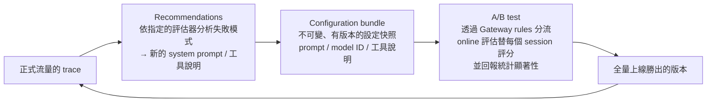

# Evaluations（含 Optimization）

> 用內建、第三方或自訂的評估器，對 agent 做線上（online）、隨選（on-demand）、批次（batch）、資料集（dataset）評估；再透過 Optimization 把評估結果轉成 prompt 和工具說明的改善建議，最後用 A/B test 驗證。
>
> 資料查核日期：2026-09-30。計費見 [00](../00-overview/README.md#計費模型)；評估的資料來源是 [06-observability](../06-observability/) 收集的 trace。

## TL;DR

- **為什麼需要：** agent 的「錯」常常是語意上的錯，例如答錯、選錯工具、沒完成任務，但 HTTP 狀態碼是 200，**傳統的測試和監控抓不到**。Evaluations 是「**針對 agent 行為的自動化測試與品質監控**」。
- **資料來源就是 06 的 trace：** 評估器讀取 session、trace、span，對三個層級評分：
  - **SESSION**：整段對話是否達成目標。
  - **TRACE**：單次回答的品質。
  - **TOOL_CALL**：這次工具選得對不對、參數對不對。
  - **沒有開啟 observability 就不能評估。**
- **評估器有四種：**
  - **Built-in**：16 個，大多用 LLM 當評審；軌跡比對類是程式判斷，**不花 token**。
  - **Third-party**：DeepEval、AutoEval 的評估器，由 AWS 代管執行。
  - **Custom LLM-as-judge**：自己寫評分指示、選模型、定評分量表。
  - **Code-based**：用 Lambda 寫確定性的檢查規則。
- **執行模式有五種：**
  - **Online**：對正式流量抽樣，持續評分。
  - **On-demand**：指定 trace 或 session 評分。
  - **Batch**：非同步地大量評分，價格打 75 折。
  - **Dataset**（預覽）：用預先準備的題庫實際跑 agent 再評分。
  - **Simulation**：用 LLM 扮演使用者，自動跟 agent 對話。
- **Ground truth**（標準答案、斷言、預期的工具順序）**只能用在離線評估**，因為線上流量沒有標準答案。
- **Optimization** 是閉環：讀取 trace → 產生新的 system prompt 或工具說明的**建議** → 打包成 **configuration bundle** → 透過 **Gateway 分流做 A/B test**，並附統計顯著性 → 全量上線。

## 先對齊幾個 AI 名詞

| 名詞 | 白話解釋 | 類比 |
|------|---------|------|
| **LLM-as-a-judge** | 請另一個 LLM 依照評分標準幫輸出打分數，並附上理由 | 自動化的 code review 評分員，但本身也可能看走眼 |
| **Ground truth** | 已知的正確答案或預期行為 | 單元測試的 expected value |
| **Trajectory**（軌跡） | Agent 依序呼叫了哪些工具 | 呼叫鏈 / call stack 的序列 |
| **Faithfulness**（忠實度） | 回答有沒有超出它拿到的資料，有沒有憑空編造 | 報表數字有沒有對得上來源資料 |
| **Hallucination** | 模型自信地產生錯誤或捏造的內容 | 一本正經地胡說八道 |

**LLM 評審的限制（判斷）：** 評審本身也是 LLM，**分數會有雜訊和偏誤**，例如偏好比較長的回答，或偏好跟自己同一系列的模型。所以要：

- 看趨勢和分布，不要看單一分數。
- 關鍵指標用 code-based 或軌跡比對這類**確定性**的方法。
- 定期抽樣做人工複核，校準評審。

## 評估器

### 內建評估器（`Builtin.*`，設定不能修改）

| 層級 | ID | 評什麼 | Ground truth |
|------|-----|--------|--------------|
| Session | `GoalSuccessRate` | 整段對話有沒有達成使用者的目標 | 可選：`assertions`（用自然語言寫的斷言） |
| Session | `TrajectoryExactOrderMatch` | 工具呼叫的順序**完全一致** | `expectedTrajectory`（**程式判斷，不花 token**） |
| Session | `TrajectoryInOrderMatch` | 預期的工具依序出現，中間可以夾其他工具 | 同上 |
| Session | `TrajectoryAnyOrderMatch` | 預期的工具都有出現，順序不拘 | 同上 |
| Trace | `Correctness` | 回答是否正確 | 可選：`expectedResponse` |
| Trace | `Faithfulness` | 回答是否忠於上下文，有沒有捏造 | — |
| Trace | `Helpfulness` | 對使用者有沒有幫助 | — |
| Trace | `ResponseRelevance` | 是否切題 | — |
| Trace | `InstructionFollowing` | 有沒有遵守指示 | — |
| Trace | `Coherence` / `Conciseness` | 是否連貫、是否簡潔 | — |
| Trace | `Harmfulness` / `Stereotyping` / `Refusal` | 安全性：有害內容、刻板印象、不必要的拒答 | — |
| Tool | `ToolSelectionAccuracy` | 這一步選的工具對不對 | — |
| Tool | `ToolParameterAccuracy` | 工具的參數是否忠於上下文，有沒有捏造參數 | — |
| Tool（skill） | `SkillSelectionAccuracy` / `SkillInstructionFollowing` | 有沒有載入正確的 skill、有沒有照 skill 的指示做 | — |

- 評審用的 prompt 範本是**公開的**，可以用來理解評分邏輯，或作為自訂評估器的起點。
- 內建評估器可能透過**跨區域推論**（cross-region inference）執行，**資料駐留有要求的話要注意**。

### 第三方與自訂評估器

| 類型 | 做法 | 適合 |
|------|------|------|
| **Third-party managed** | 直接用 ID 指定，例如 `ThirdParty.DeepEval.TaskCompletion`、`ThirdParty.AutoEval.Security`，由 AWS 選模型並執行 | 想用業界常見的指標 |
| **CustomDerived** | 沿用內建或第三方評估器的 prompt 和評分量表，但**改用你指定的 Bedrock 模型** | 資料駐留、成本、模型一致性的考量 |
| **Custom LLM-as-judge** | 自己寫評分指示和量表，選擇模型；可以用 `{context}`、`{assistant_turn}`、`{available_tools}`、`{expected_response}`、`{assertions}` 等 placeholder | 領域特定的品質標準，例如金融法遵用語 |
| **Code-based**（Lambda） | 輸入是整個 session 的 span（最多 6 MB，超過會被截斷），輸出 `label`、`value`、`explanation`；Lambda 最長 300 秒 | **確定性的規則**：輸出是否為合法 JSON、有沒有洩漏個資（regex）、是否呼叫了禁止的 API、是否符合業務規則 |

**注意：**

- **使用 ground truth placeholder 的自訂評估器，不能放進 online 評估。**
- **Code-based 評估器一旦被啟用中的 online 設定引用，就會被鎖住**，不能修改或刪除，要先停用設定，或複製一份新的。

## 五種執行模式

| 模式 | 輸入 | 用途 | 注意事項 |
|------|------|------|---------|
| **Online** | 正式流量，依比例抽樣（例如 10%）或依條件過濾 | **持續監控品質**，看趨勢、找出低分的 session | 不能用 ground truth；每個設定最多 25 個評估器；每個帳號最多 1,000 個設定 |
| **On-demand**（`Evaluate` API） | 指定的 span、trace、session | 調查客訴、驗證修正、開發期測試、試用自訂評估器 | 要先等 CloudWatch 收進資料，大約 2–5 分鐘；每個請求只能用 1 個評估器 |
| **Batch** | 指定 CloudWatch Logs 的位置和時間範圍，由服務端自動找出 session | **改動前後的比較、回歸測試、定期稽核** | **token 單價打 75 折**；同時只能跑 5 個；每個 job 最多 500 個 session、10 個評估器 |
| **Dataset**（預覽） | 預先準備的情境：輸入、預期回應、斷言、預期軌跡 | **Runner 會實際呼叫 agent**，然後評分。相當於 agent 的整合測試 | 由 SDK 端驅動 |
| **Simulation** | 角色設定（背景、目標、個性特質）加上第一句話 | 用 LLM 扮演使用者**進行多輪對話**，直到達成目標或到達回合上限，然後評分 | 扮演使用者的模型要另外付 Bedrock 費用；**不能用每一輪的預期回應和預期軌跡**，只能用 `assertions` |

**建議的導入順序（判斷）：**

1. 開發期：用 on-demand 加 dataset 做回歸測試，並接進 CI。
2. 上線前：用 simulation 擴大情境的覆蓋率。
3. 上線後：用 online 抽樣持續監控。
4. 每次改 prompt 或模型之前與之後：用 batch 做比較。

## Optimization：從評估結果到改善

- **Configuration bundle：** 把「agent 的行為設定」從程式碼中抽出來。
  - Gateway 用 **W3C baggage** header（`aws.agentcore.configbundle_arn` / `_version`）把這次請求該用哪個版本告訴 Runtime。
  - Agent 程式呼叫 `BedrockAgentCoreContext.get_config_bundle()` 取得設定（需要 SDK ≥ 1.8）。
  - Strands 建議用 `BeforeModelCallEvent` hook，在每次呼叫模型前套用。
  - **一定要設定預設值**：沒有 A/B test 時會拿到空的 dict，而 API 呼叫失敗時會拋出例外。
- **A/B test 的兩種形式：**
  - **設定不同**：同一個 runtime，不同的 bundle 版本。
  - **程式碼不同**：不同的 gateway target，指向不同的 runtime endpoint。
  - 每個 gateway **同時只能跑 1 個** A/B test，而且**只能分成兩組**（對照組 + 一個實驗組）；每個帳號同時最多 20 個。
- **計費：** Insights 在預覽期間免費；Recommendations 本身免費，只收它用到的 Evaluations 費用；A/B test 依底層的 Gateway、Runtime、Evaluations 計費。

**這個閉環的價值：** 過去 prompt 的調整靠直覺，改完之後也說不清楚是變好還是變壞。現在可以做到「**有資料依據的改動**，加上**有統計檢定的上線決策**」，流程跟一般產品功能的 A/B test 一樣。

## 支援的框架

Strands、LangGraph、OpenAI Agents、Vercel AI SDK、LlamaIndex、Google ADK、**Claude Agent SDK**，以及通用的方式（只要用 OTel 或 OpenInference 做 instrumentation）。前提是這個框架輸出的 span 符合 GenAI semantic conventions，評估器才讀得懂。

## 值得注意的配額與計費

| 項目 | 值 |
|------|-----|
| 內建評估器 | 每千個 input token $0.0024 / 每千個 output token $0.012；每分鐘最多 1,000,000 個 input token、1,200 次評估（**孟買和新加坡只有 200 次**，不可調整） |
| 自訂評估器 | 每千次評估 $1.50，**模型費用另計** |
| Batch | token 單價打 75 折 |
| 單次評估的上限 | 每次評估 200,000 個 input token；每個 session 20,000 個 span、200 MB |

**成本直覺（判斷）：** 評審要讀完整的對話上下文，所以**長對話的評估成本會跟著上下文長度增加**。Online 評估的抽樣比例和評估器的數量，是主要的成本控制手段。

## 踩雷清單

1. **沒有 observability 就沒有評估**：需要開啟 Transaction Search，並加上 ADOT instrumentation。
2. **Ground truth 只能離線使用**，用了 ground truth placeholder 的自訂評估器不能放進 online 評估。
3. **On-demand 評估要等 CloudWatch 收進資料**（2–5 分鐘），CI 裡要加等待時間。
4. **LLM 評審有雜訊和偏誤**，關鍵指標要搭配確定性的評估器，並定期人工校準。
5. **內建評估器可能跨區域推論**，要注意資料駐留的要求。
6. **Code-based 評估器被啟用中的 online 設定引用時，不能修改或刪除。**
7. **Code-based 評估器的輸入超過 6 MB 會被截斷**，長 session 可能看不到完整資料。
8. **每個 gateway 同時只能跑 1 個 A/B test**，而且只能分成兩組。
9. **讀取 configuration bundle 一定要設定預設值**，並處理 API 呼叫失敗的情況。
10. **孟買和新加坡的內建評估器速率只有其他區域的六分之一。**

## 與其他元件的關係

- **Observability（06）：** 唯一的資料來源。
- **Runtime / Harness：** Harness 可以直接從設定開啟評估與 Optimization（見 [00 延伸](../00-overview/harness-vs-runtime.md)）；Runtime 則是由 agent 程式讀取 configuration bundle。
- **Gateway（03）：** A/B test 的分流靠 gateway rules 的依權重分流。
- **Memory（02）：** Episodic 記憶的 reflection 和評估結果是互補的：一個是 agent 自己從經驗中學，一個是由外部評分。

## 研究問題

- [x] Built-in evaluator 清單
- [x] Custom / CustomDerived / ThirdParty（DeepEval、AutoEval）/ Code-based 評估器
- [x] On-demand、online、batch 三種評估模式（外加 dataset、simulation）
- [x] 與 Observability trace 的關聯
- [x] （補充）Optimization：recommendations、configuration bundle、A/B test

## 參考資料

- [Evaluation terminology](https://docs.aws.amazon.com/bedrock-agentcore/latest/devguide/evaluations-terminology.html)、[Evaluators](https://docs.aws.amazon.com/bedrock-agentcore/latest/devguide/evaluators.html)、[Evaluation types](https://docs.aws.amazon.com/bedrock-agentcore/latest/devguide/evaluations-types.html)
- [Built-in prompt templates](https://docs.aws.amazon.com/bedrock-agentcore/latest/devguide/prompt-templates-builtin.html)、[Ground truth](https://docs.aws.amazon.com/bedrock-agentcore/latest/devguide/ground-truth-evaluations.html)
- [Custom evaluators](https://docs.aws.amazon.com/bedrock-agentcore/latest/devguide/custom-evaluators.html)、[Code-based](https://docs.aws.amazon.com/bedrock-agentcore/latest/devguide/code-based-evaluators.html)
- [User simulation](https://docs.aws.amazon.com/bedrock-agentcore/latest/devguide/user-simulation.html)
- [Optimization：How it works](https://docs.aws.amazon.com/bedrock-agentcore/latest/devguide/optimization-how-it-works.html)、[Configuration bundles at runtime](https://docs.aws.amazon.com/bedrock-agentcore/latest/devguide/configuration-bundles-runtime.html)
- [Quotas](https://docs.aws.amazon.com/bedrock-agentcore/latest/devguide/bedrock-agentcore-limits.html)、[Pricing](https://aws.amazon.com/bedrock/agentcore/pricing/)

## 延伸調研方向

範圍在 00–07 之內，以 07 為主：

1. **Agent 的測試金字塔與 CI 整合：** 用 code-based 評估器做確定性檢查、用 dataset 和軌跡比對做回歸測試、用 simulation 擴大覆蓋率、用 online 抽樣做正式環境監控，並設計在 CI 裡怎麼等待資料收進 CloudWatch、怎麼設定通過門檻。
2. **LLM 評審的可靠度校準：** 人工標註一小批 session，比較 built-in、CustomDerived（換模型）、自訂評審的分數與人工判斷的一致性，找出偏誤，並決定哪些指標要改用確定性的方法。
3. **Optimization 閉環的實際導入：** 把 system prompt 和工具說明搬進 configuration bundle 的程式改寫方式；A/B test 的樣本數與實驗時間估算；recommendation 產生的 prompt 要怎麼審查才上線，才不會讓 agent 改壞。
