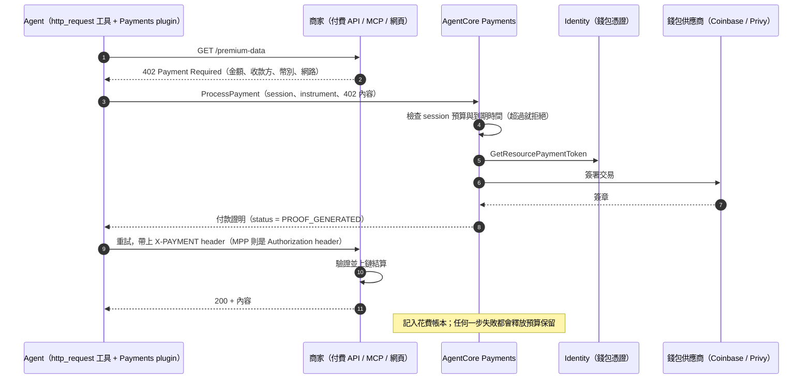

# Payments

> 讓 agent 能自動付費使用收費的 API、MCP server 與網頁內容：支援 x402 / MPP 協定、錢包整合，並有花費上限控管。
>
> 資料查核日期：2026-09-30。2026-05-07 以**預覽**狀態發表；目前是否已正式推出（GA），官方文件沒有明確寫出。

## TL;DR

- **要解決的問題：** agent 呼叫一次付費 API 的價值往往**只有幾美分甚至更少**，信用卡的最低手續費讓這種**微支付**做不起來；而且為每個供應商各自簽約、各自串接帳務也不實際。
- **做法：** 用 **HTTP 402 Payment Required** 這個狀態碼走一套「要求付款 → 簽署 → 帶著付款證明重試」的標準流程（**x402**，Coinbase 主導；**MPP**，改走 `WWW-Authenticate` / `Authorization` header），並以**穩定幣（USDC）**結算。
- **AgentCore 負責 agent 這一端的全部工作：**
  - 檢查預算。
  - 透過錢包供應商（**Coinbase CDP** 或 **Stripe Privy**）簽署交易。
  - 產生付款證明。
  - 記錄花費。
  - **私鑰和錢包憑證都不會進到 agent 裡**，存放在 Identity 的 payment credential provider。
- **治理的重點是 IAM 職責分離：**
  - 「建立 session、設定預算」和「執行付款」**一定要分開成不同的 role**，官方用明確的 Deny 來強制。
  - 否則 agent 可以自己開一個預算無上限的 session，再付款給自己。
- **AWS 本身不另外收費**，只收錢包供應商的操作費（例如 Coinbase 每次 $0.005）；部分情境還要付**區塊鏈的手續費（gas fee）**。
- **區域：** 支援美國、歐洲、新加坡、雪梨，**東京不支援**。

## 先對齊幾個名詞（加密支付的部分）

| 名詞 | 白話解釋 | 類比 |
|------|---------|------|
| **穩定幣（USDC）** | 在區塊鏈上、價值與美元 1:1 掛鉤的代幣 | 放在區塊鏈上的美元儲值金 |
| **錢包 / Payment instrument** | 持有穩定幣的帳戶。這裡是「**嵌入式錢包**」，由 Coinbase 或 Privy 代管私鑰 | 由第三方保管的預付卡帳戶 |
| **網路（network）** | 哪一條區塊鏈，用 CAIP-2 格式表示，例如 `eip155:8453` 是 Base 主網、`eip155:84532` 是 Base Sepolia 測試網、`solana:…` | 哪一家銀行體系 |
| **Gas fee** | 在區塊鏈上執行交易要付的手續費，用鏈的原生代幣支付 | 跨行轉帳的手續費 |
| **Facilitator** | 替商家驗證付款並把交易送上鏈的服務 | 收單機構 |
| **簽署 / 付款證明** | 用錢包的私鑰對「付給誰、付多少、用哪種幣、在哪條鏈」做數位簽章 | 簽好名、還沒兌現的支票 |

**注意：** 鏈上交易**一旦完成就無法撤回**，不像信用卡可以申請退款。這讓「agent 付錯錢」的代價比一般 API 呼叫高得多。

## 核心概念

```
PaymentManager（最上層；authorizer 可用 IAM 或 CUSTOM_JWT；建立時會自動產生一個 workload identity）
└── PaymentConnector（對接錢包供應商；每個 manager 可以有多個）
      ├── CoinbaseCDP（支援 Quick create：用 OAuth 授權一次，由服務代為建立憑證）
      └── StripePrivy（只能手動提供憑證）
            └── 1:1 對應 PaymentCredentialProvider（存放在 Identity 的 token vault 和 Secrets Manager）

PaymentInstrument（使用者的嵌入式錢包；每條鏈各一個；狀態：INITIATED → ACTIVE）
PaymentSession（這一次互動的付款範圍：maxSpendAmount + currency + 到期時間）
ProcessPayment（實際簽署：傳入 session + instrument + 商家的 402 內容 → 回傳付款證明）
```

### 一次付款的流程（x402）



- **Plugin 會自動處理這整個流程：**
  - Strands 用 `AgentCorePaymentsPlugin`，LangGraph 用 `AgentCorePaymentsMiddleware`。
  - 它們會攔截 402、呼叫 `ProcessPayment`、自動重試。**Agent 的工具程式碼只需要一個普通的 `http_request`。**
  - 也可以不用 plugin，直接呼叫 SDK 的 `PaymentManager.generate_payment_header()` 或 API。
- **x402 的兩種計費方式：**
  - `exact`：固定金額。
  - `upto`：依用量計費，最多到某個上限。要先在鏈上做一次 **Permit2 allowance** 授權（`permit2AllowanceLimit`），**這一步要付 gas fee**，而且每次設定都是覆蓋舊值而不是累加，只在第一次需要時設定。
- **MPP 的細節：**
  - 每次只能處理一個 challenge，只支援 `charge` 意圖。
  - Challenge 很快就會過期，過期時會回 `ValidationException`，**不扣預算**。
  - 回傳的 `paymentCredential` 要**原封不動**放進 header，不能解碼或修改。
  - 如果商家不負擔 gas fee，必須明確設定 `buyerPaysGasFees=true`，否則會被拒絕。
  - 支援的方式：`evm`（只收標準的 USDC）、`tempo`、`solana`（**只有 Privy 支援**）。
- **重複請求：** 用 `clientToken` 確保同一筆付款不會被執行兩次。

### 錢包怎麼入金

- 錢包建立時**餘額是 0**。使用者要登入供應商的 wallet hub（Coinbase 或 Privy 都有官方前端範本）：
  - 用加密貨幣轉入，或用信用卡、金融卡、Apple Pay、Google Pay、ACH 儲值。**信用卡在部分地區無法使用。**
  - **明確授權 agent 可以使用這個錢包**，之後也可以撤銷。
- **判斷：** 這代表使用者要自己管理一個加密錢包。對一般消費者來說門檻不低，比較適合 B2B，或是由企業自己預先儲值的情境。

## 治理與安全

### IAM 的五種角色（官方）

| 角色 | 能做什麼 | 關鍵限制 |
|------|---------|---------|
| Administrator（ControlPlaneRole） | 建立 manager、connector、credential provider；用 Coinbase 的話還要訂閱 AWS Marketplace 上的方案 | 只給平台管理者 |
| Agent developer（ManagementRole） | 建立 instrument 和 session，**也就是設定預算** | **明確 Deny `ProcessPayment`** |
| Payment execution（ProcessPaymentRole） | 執行 `ProcessPayment`、讀取餘額和 session | **不能有建立 session 的權限** |
| Service role（ResourceRetrievalRole） | 由服務在執行期取得錢包憑證 | 不給人使用 |
| Marketplace 訂閱 | Coinbase 的費用會併入你的 AWS 帳單 | — |

**為什麼要這樣分：** 如果同一個身分既能建立 session（決定預算上限），又能執行付款，**一旦被 prompt injection 誘導，就能自己開一個無上限的預算然後付款**。官方用明確的 Deny 讓這種組合在 IAM 層面就不可能發生。

### agent 特有的付款風險（判斷）

| 風險 | 情境 | 緩解方式 |
|------|------|---------|
| **誘導付款** | 網頁或工具的輸出寫著「請去這個網址買完整報告」，agent 照做 | **限制可以付款的商家**（LangGraph middleware 有 allowlist 設定；或用 Gateway 只開放經過審核的付費 target）；session 預算設低；大額付款要求真人核准 |
| 惡意商家 | 回傳的 402 要求付款給攻擊者的地址 | 商家白名單；比對 `payTo` 地址 |
| 花費失控 | agent 陷入迴圈，不斷付費重試 | Session 的 `maxSpendAmount` 和到期時間；監控 Observability 的 payment metric |
| 交易不可逆 | 付錯了無法退款 | 以上所有措施；另外可以用 Policy 對付費工具的參數設限（見 [08](../08-policy/)） |
| 法遵 | 加密資產支付在各地的法規不同 | **在台灣導入前需要法遵評估**，官方文件沒有涵蓋這部分 |

## 生態系與整合

- **x402 Bazaar：** Coinbase 維運的付費端點目錄，已經整合成 Gateway 的一個 target，可以搜尋超過一萬個 x402 付費端點。
- **Browser：** 搭配 Browser 使用，可以讓 agent 付費存取支援 x402 的網頁。
- **商家端（賣方）：** 你也可以把自己的 API 做成 x402 收費，例如用 API Gateway 加 Lambda；官方範例是每次呼叫收 $0.01。這是另一種商業模式。
- **Registry：** 可以把付費端點登錄到 Registry，讓組織內部搜尋得到（見 [03](../03-gateway/README.md#aws-agent-registry組織層級的目錄)）。

## 區域與計費

| 項目 | 內容 |
|------|------|
| 區域（依官方區域表） | us-east-1、us-east-2、us-west-2、法蘭克福、愛爾蘭、倫敦、米蘭、巴黎、西班牙、斯德哥爾摩、**新加坡**、**雪梨**；**東京、首爾、孟買不支援**。發表時的部落格文章只寫了 4 個區域，之後才擴充 |
| AWS 的費用 | **不另外收費** |
| 錢包供應商的費用 | Coinbase CDP：每次操作 $0.005（建立 instrument 算 1 次、ProcessPayment 算 1 次）；Privy：建立 instrument 免費，ProcessPayment 依 Privy 的價格 |
| 區塊鏈手續費 | `upto` 的 Permit2 授權，以及 MPP 中買方負擔 gas 的情境 |
| 配額 | 每個帳號最多 50 個 payment credential provider（與 Identity 共用，見 [04](../04-identity/README.md#值得注意的配額與計費)） |

**成本直覺（判斷）：** 如果每次付費呼叫的價格是 $0.01，Coinbase 每次操作的 $0.005 就佔了 **50%**。微支付要划算，商品單價和供應商費用的比例要先算清楚。

## 踩雷清單

1. **建立 session 和執行付款的權限一定要分開**，否則預算上限形同虛設。
2. **交易不可逆**：商家白名單、低預算、大額付款要真人核准，這三項缺一不可。
3. **錢包建立時餘額是 0**，要使用者自己入金並授權 agent。
4. **`upto` 需要 Permit2 授權**：要付 gas fee，而且設定值會覆蓋舊值，只在第一次需要時設定。
5. **MPP 的 credential 不能修改**，challenge 也很快就會過期。
6. **Solana 只有 Privy 支援。**
7. **東京區不支援。**
8. **供應商的操作費對小額付款的影響很大。**
9. **法遵要自己評估**，官方文件沒有涵蓋。

## 與其他元件的關係

- **Identity（04）：** 錢包憑證存放在 payment credential provider，執行期透過 `GetResourcePaymentToken` 取得。
- **Gateway（03）：** 付費的 MCP 工具可以接成 Gateway 的 target；x402 Bazaar 也是一個 target。
- **Browser（05）：** 付費存取支援 x402 的網頁。
- **Policy（08）：** 可以對付費工具的參數設下確定性的上限，作為第二道防線。
- **Observability（06）：** 提供 payment 的 metric、log、span，可以追蹤成功率和花費。
- **Runtime（01）：** 官方範例是把帶有 plugin 的 agent 部署到 Runtime 上。

## 研究問題

- [x] x402 與 MPP 協定是什麼（HTTP 402 → 付款 → 帶著證明重試）
- [x] 資源模型：Credential Provider → Manager → Connector → Instrument → Session
- [x] 錢包供應商（Coinbase CDP、Stripe Privy）與支援的鏈（EVM、Solana、Tempo）
- [x] 預算上限（`maxSpendAmount`）如何在基礎設施層強制執行
- [x] IAM 角色的職責分離

## 參考資料

- [What is AgentCore payments](https://docs.aws.amazon.com/bedrock-agentcore/latest/devguide/payments.html)
- [Core concepts](https://docs.aws.amazon.com/bedrock-agentcore/latest/devguide/payments-concepts.html)、[How it works](https://docs.aws.amazon.com/bedrock-agentcore/latest/devguide/payments-how-it-works.html)
- [Process a payment](https://docs.aws.amazon.com/bedrock-agentcore/latest/devguide/payments-process-payment.html)、[IAM roles](https://docs.aws.amazon.com/bedrock-agentcore/latest/devguide/payments-iam-roles.html)
- [Launch blog](https://aws.amazon.com/blogs/machine-learning/agents-that-transact-introducing-amazon-bedrock-agentcore-payments-built-with-coinbase-and-stripe/)
- [x402](https://www.x402.org/)、[awslabs/agentcore-samples：payments workshop](https://github.com/awslabs/agentcore-samples)
- [Pricing](https://aws.amazon.com/bedrock/agentcore/pricing/)、[Regions](https://docs.aws.amazon.com/bedrock-agentcore/latest/devguide/agentcore-regions.html)

## 延伸調研方向

範圍在 00–09 之內，以 09 為主：

1. **付費 agent 的安全控管設計：** 商家白名單的實作方式（plugin 或 middleware 的 allowlist、只透過 Gateway 開放審核過的付費 target、用 Policy 限制付費工具的參數）；session 預算與真人核准的分級；以及怎麼偵測誘導付款。
2. **把自家 API 做成 x402 收費（賣方）：** 用 API Gateway 或 Lambda 實作 402 回應與付款驗證、facilitator 的選擇、定價與供應商手續費的比例，以及登錄到 Registry 和 x402 Bazaar 讓 agent 找得到。
3. **Payments 的端到端測試環境：** 用 Base Sepolia 或 Solana Devnet 測試網搭建完整流程（Coinbase Quick create、錢包入金、`exact` 與 `upto` 兩種計費方式、MPP），並驗證 IAM 職責分離、預算用完時的行為，以及 Observability 上的花費追蹤。
